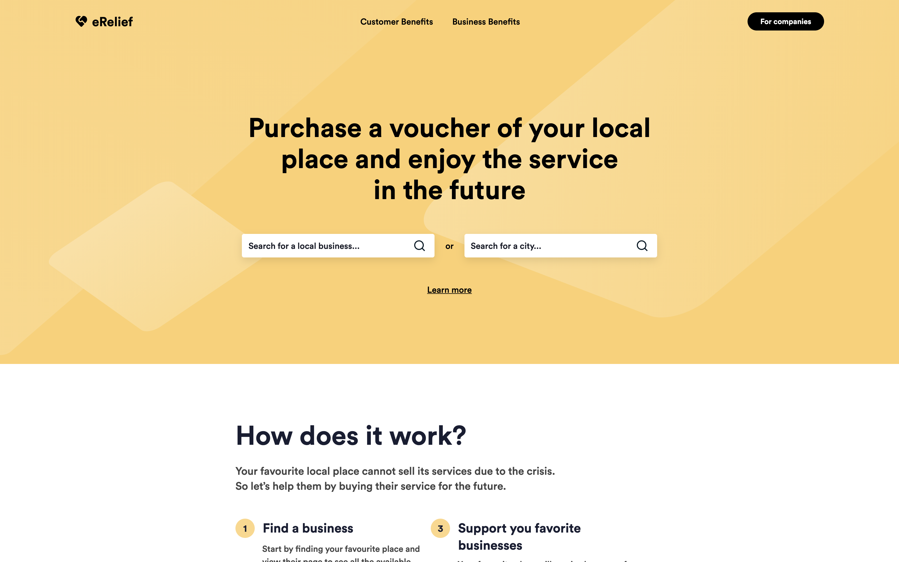
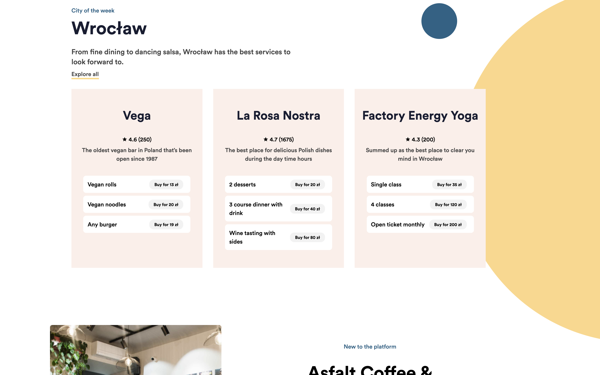
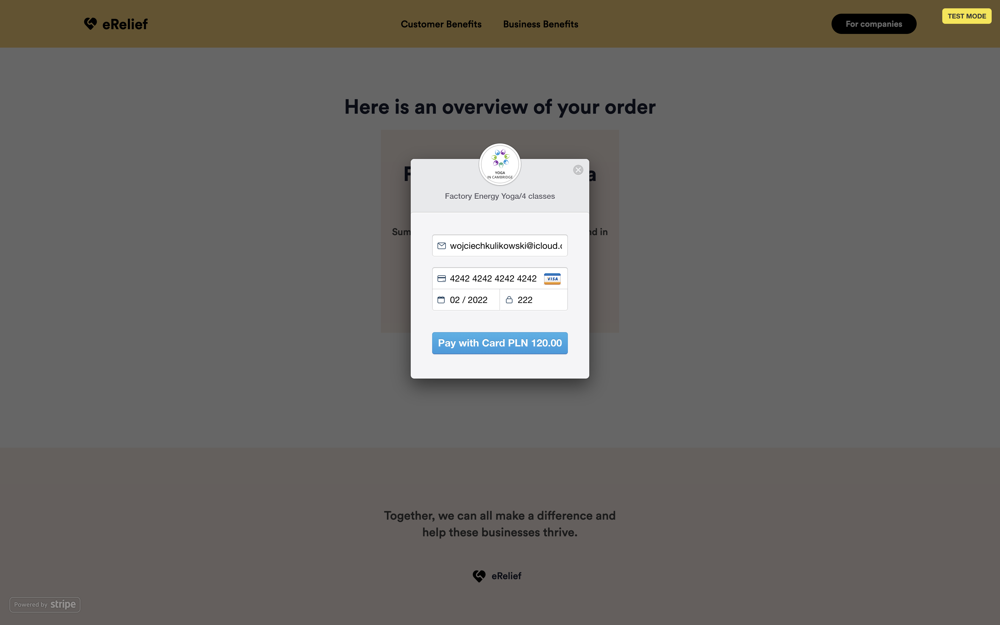
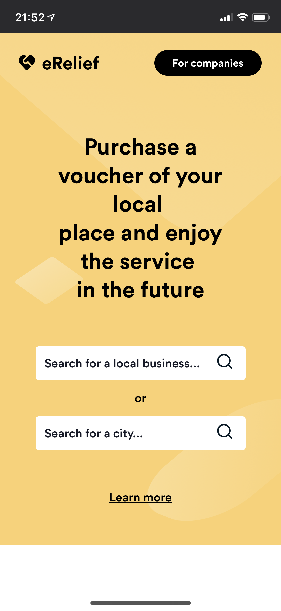
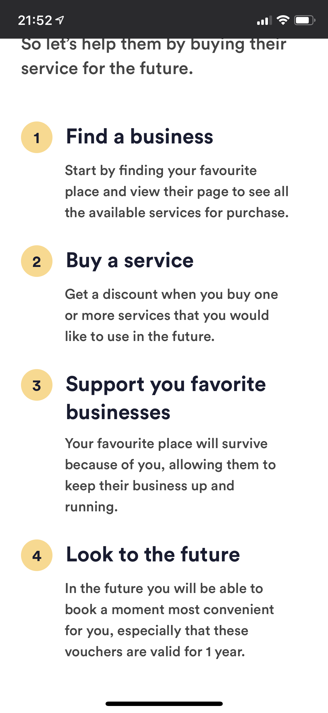
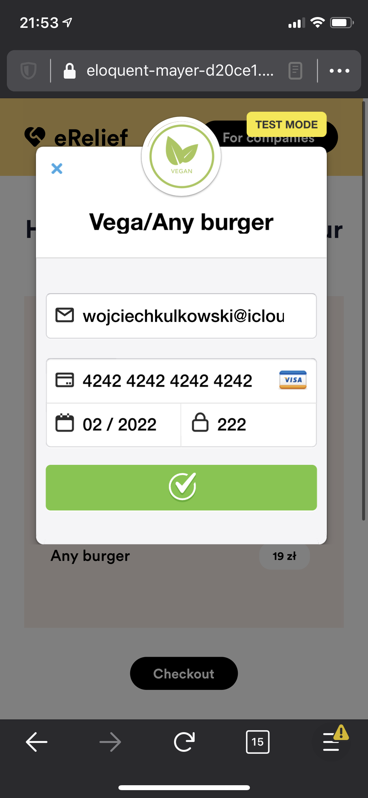

# Entrepreneur Relief
Entrepreneur Relief is our answer to COVID19 epidemic forcing local businesses to close. It allows:
- the business owners to easily produce vouchers
- the customers to buy them and ensure that their favorite dance schools / hairdressers / caffees survive the enpidemic

## Purpose
Together with a team of 6 we participated in a Polish hackathon -- [HackCrisis](https://www.hackcrisis.com/). We got shortlisted to top 30 (out of over valid 100 submissions), but felt short in the final 🤷🏻‍♂️
This is working MVP, you can check it out at https://eloquent-mayer-d20ce1.netlify.com/ (probably a dead link in the future) or locally with `yarn install / yarn serve!`

## Product
We have built the app with VueJS for frontend and AWS Lambda for handling emails.
Our designs have been done with ❤️ and [figma](https://www.figma.com/file/MaZjbGi6JZENP5fqP52fS7/Relief-Wireframes?node-id=45%3A1355)

Here is a walk-through!

### As you enter the ladning page you can immidiately search for you favourite local businesses...


### ...or support recommended ones!


### Once you have chosen a voucher, you can pay for the service.


### It works on mobile as well!




## Development & contributions
We currently stopped developing the app. If you want to contribute/learn Vue please feel free to reach out! This would be a cool learning opportunity (certainly was for me) 🚀

### Project setup
```
yarn install
```

### Compiles and hot-reloads for development
```
yarn serve
```

### Compiles and minifies for production
```
yarn build
```
